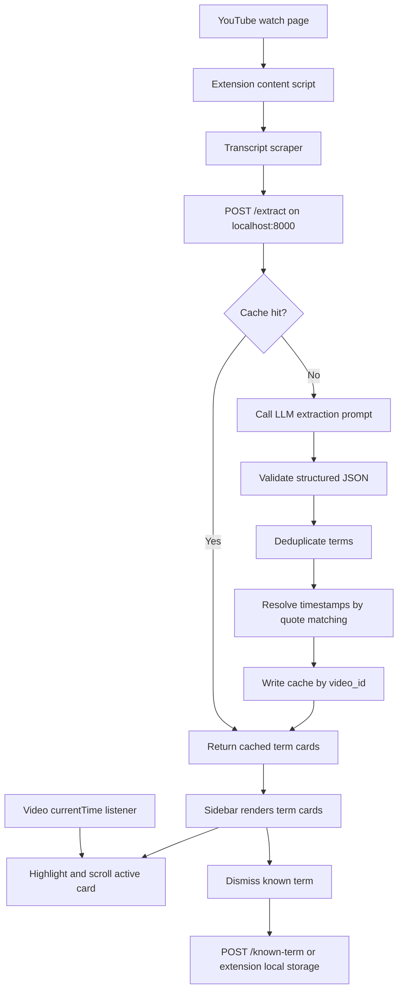

# Footnote Implementation Plan

This plan translates `Project Overview.pdf` into an executable MVP roadmap for Footnote: a local Chrome extension and FastAPI backend that add proactive, timestamp-synced glossary cards to YouTube videos.

## Product Summary

Footnote is a real-time glossary sidebar for technical YouTube videos and podcast-style video content. It extracts the full transcript, identifies terms the listener may not know, generates short and deeper explanations, then syncs those cards to playback.

The key product bet is proactive comprehension support. The user should not need to pause the video, search, or ask a chatbot.

## MVP Boundaries

Build for one user on one machine.

In scope:

- Chrome extension using Manifest V3.
- YouTube only.
- Local FastAPI backend at `localhost:8000`.
- Full-transcript analysis upfront.
- LLM extraction using the OpenAI API with the model configured by environment variable.
- JSON cache keyed by YouTube video ID.
- Known-term storage for dismissed terms.
- Sidebar with sorted term cards.
- Active-card highlighting and auto-scroll based on playback time.

Out of scope for MVP:

- Auth, accounts, or cloud deployment.
- Standalone podcast player.
- Chatbot or summary experience.
- Streaming transcript analysis.
- Multi-platform support.
- Database.
- Multi-user personalization model.

## Recommended Repository Shape

```text
Podcast Footnote Project/
  backend/
    app.py
    extraction_prompt.py
    models.py
    storage.py
    timestamping.py
    requirements.txt
    .env.example
    tests/
      fixtures/
        sample_transcript.json
      test_timestamping.py
      test_storage.py
  extension/
    manifest.json
    content.js
    sidebar.css
    transcript.js
    playback.js
    api.js
    storage.js
    icons/
  data/
    cache/
    known_terms.json
  docs/
    IMPLEMENTATION_PLAN.md
    EXTRACTION_PROMPT.md
    TESTING_CHECKLIST.md
```

For the current workspace, this file can stay at the root until the project structure exists. Once implementation begins, move or copy it into `docs/IMPLEMENTATION_PLAN.md`.

## System Architecture



## Core Data Contracts

### Transcript Segment

```json
{
  "start": 123.45,
  "duration": 4.2,
  "text": "The model uses LoRA adapters during fine tuning."
}
```

### Extract Request

```json
{
  "video_id": "abc123",
  "video_url": "https://www.youtube.com/watch?v=abc123",
  "title": "Optional video title",
  "listener_profile": "Technically curious generalist...",
  "known_terms": ["backpropagation", "GPU"],
  "transcript": [
    {
      "start": 123.45,
      "duration": 4.2,
      "text": "The model uses LoRA adapters during fine tuning."
    }
  ]
}
```

### Term Card

```json
{
  "id": "lora",
  "term": "LoRA",
  "expansion": "Low-Rank Adaptation",
  "one_liner": "A lightweight way to fine tune a large AI model.",
  "deeper": "LoRA trains small adapter matrices instead of changing every model weight. In this conversation, it matters because it lowers the cost and memory needed for fine tuning.",
  "quote": "uses LoRA adapters during fine tuning",
  "category": "ml_research",
  "timestamp": 123.45,
  "confidence": 0.86
}
```

### Known Term

```json
{
  "term": "LoRA",
  "normalized": "lora",
  "dismissed_at": "2026-05-02T00:00:00Z",
  "source_video_id": "abc123"
}
```

## Implementation Sequence

### Phase 0 - Bootstrap

Goal: Create a runnable skeleton with clear local setup.

Deliverables:

- `backend/requirements.txt`
- `backend/.env.example`
- `backend/app.py` with `/health`
- `extension/manifest.json`
- `README.md` with local run instructions

Acceptance criteria:

- `uvicorn backend.app:app --reload --port 8000` starts.
- `GET /health` returns `{ "ok": true }`.
- Chrome can load the unpacked extension folder.

Prompt to use:

```text
You are implementing the Footnote MVP. Create the initial repository structure for a local Chrome extension plus FastAPI backend.

Backend requirements:
- Python FastAPI app in backend/app.py.
- /health endpoint returning {"ok": true}.
- requirements.txt with fastapi, uvicorn, pydantic, python-dotenv, openai, pytest.
- .env.example with OPENAI_API_KEY and OPENAI_MODEL.

Extension requirements:
- Manifest V3 in extension/manifest.json.
- Content script runs on https://www.youtube.com/watch*.
- Add placeholder content.js and sidebar.css.

Also add a README with exact local setup and Chrome extension loading steps.
Keep the implementation minimal but runnable.
```

### Phase 1 - Backend Models, Storage, and Cache

Goal: Establish robust local data handling before LLM work.

Deliverables:

- Pydantic models for transcript segments, extract requests, term cards, and responses.
- Local JSON cache under `data/cache/{video_id}.json`.
- Known terms in `data/known_terms.json`.
- Cache read/write helpers.
- Tests for storage behavior.

Acceptance criteria:

- Cache lookup returns cached cards without touching the LLM path.
- Known-term file is created automatically if missing.
- Invalid request payloads return clear validation errors.

Prompt to use:

```text
Add backend data models and JSON storage for Footnote.

Create:
- backend/models.py with Pydantic models:
  - TranscriptSegment
  - ExtractRequest
  - TermCard
  - ExtractResponse
  - KnownTerm
- backend/storage.py with:
  - get_cache(video_id)
  - set_cache(video_id, response)
  - load_known_terms()
  - add_known_term(term, source_video_id=None)

Use local JSON files under data/cache and data/known_terms.json.
Make paths work when running from the repo root.
Add focused pytest tests for cache read/write and known term persistence.
```

### Phase 2 - Extraction Prompt and Offline Test Harness

Goal: Make the extraction prompt testable before wiring real YouTube pages.

Deliverables:

- `backend/extraction_prompt.py`
- `docs/EXTRACTION_PROMPT.md`
- Fixture transcript format.
- CLI or test helper that runs extraction against a saved transcript.

Acceptance criteria:

- Prompt asks for 1 term per 3-5 minutes.
- Prompt skips terms defined by the speaker.
- Prompt filters against listener profile and known terms.
- Prompt returns JSON only.
- Prompt returns quote strings for timestamp matching instead of trusting model timestamps.

Prompt to use:

```text
Implement the Footnote extraction prompt and a backend helper for calling the OpenAI API.

Requirements:
- Store the prompt builder in backend/extraction_prompt.py.
- Input: transcript text, listener_profile, known_terms.
- Output expected from the model: strict JSON array of term objects with:
  term, expansion, one_liner, deeper, quote, category.
- Categories: ml_research, biology, neuroscience, physics, economics, medicine, cs_systems, math_stats, named_entity, other.
- The prompt must target roughly one term per 3-5 minutes.
- The prompt must skip terms that are clearly explained by the speaker.
- The prompt must avoid obvious terms from the listener profile and known_terms.
- Include docs/EXTRACTION_PROMPT.md with the full current prompt and tuning notes.

Do not build the extension UI yet.
```

### Phase 3 - LLM Endpoint

Goal: Add the actual `/extract` behavior with cache-first flow.

Deliverables:

- `POST /extract`
- OpenAI SDK integration.
- JSON parsing and validation.
- Error shape for failed extraction.
- Cache population.

Acceptance criteria:

- Request with cached video ID returns immediately.
- Request with uncached video ID calls the OpenAI API if `OPENAI_API_KEY` exists.
- Malformed model JSON is handled with a useful error.
- Valid responses conform to `ExtractResponse`.

Prompt to use:

```text
Implement POST /extract in the FastAPI backend.

Flow:
1. Accept ExtractRequest.
2. Check data/cache/{video_id}.json.
3. If cache exists, return it with cached=true.
4. If not cached, call the OpenAI API using OPENAI_API_KEY and OPENAI_MODEL from environment.
5. Parse the model response as JSON.
6. Validate into TermCard-like objects before timestamps are resolved.
7. Post-process with deduplication and timestamp resolution functions.
8. Save final response to cache and return it.

Keep API keys only in backend environment variables.
Add clear exceptions for missing API key, model failure, and invalid JSON.
```

### Phase 4 - Deduplication and Timestamp Resolution

Goal: Make cards syncable and reliable.

Deliverables:

- `backend/timestamping.py`
- Quote matching against transcript segments.
- Normalization for term dedupe.
- Tests with realistic transcript snippets.

Acceptance criteria:

- Exact quote matches resolve to the segment start time.
- Case-insensitive and whitespace-normalized quote matching works.
- Acronym and expansion duplicates collapse into one card where possible.
- Unmatched quotes are retained but marked with low confidence or omitted from sync.

Prompt to use:

```text
Implement backend post-processing for Footnote term cards.

Create backend/timestamping.py with:
- normalize_text(text)
- normalize_term(term)
- dedupe_terms(raw_terms)
- resolve_timestamps(raw_terms, transcript_segments)

Timestamp strategy:
- Use the LLM-provided quote as the primary signal.
- Match quote against transcript segment text with case and whitespace normalization.
- If quote spans adjacent transcript segments, match against a rolling combined window.
- Set timestamp to the earliest matching segment start.
- Add confidence values: high for exact/normalized match, lower for fuzzy or unmatched.

Add pytest coverage for exact matches, whitespace variants, adjacent segment matches, duplicate acronym/expansion cases, and unmatched quotes.
```

### Phase 5 - Transcript Scraping

Goal: Get usable timestamped transcript data from YouTube.

Deliverables:

- `extension/transcript.js`
- Video ID detection.
- Transcript fetch from YouTube timedtext endpoint where available.
- DOM transcript panel fallback if endpoint approach fails.
- Clear no-transcript UI state.

Acceptance criteria:

- On a YouTube watch page, extension can produce a list of `{ start, duration, text }`.
- Transcript scraper does not require user login beyond the current browser session.
- Failure state is visible and non-destructive.

Prompt to use:

```text
Implement YouTube transcript collection for the Footnote extension.

Requirements:
- Detect the current YouTube video ID from location.href.
- Try to fetch timestamped transcript data using YouTube's available caption/timedtext data from the page.
- Parse transcript into [{start, duration, text}].
- If the endpoint path is unavailable, add a DOM transcript fallback that opens/uses the transcript panel when possible.
- Return clear errors for:
  - no video ID
  - no captions available
  - transcript fetch blocked

Keep this in extension/transcript.js and expose a single async function getTranscript().
```

### Phase 6 - Extension API Client and Sidebar Rendering

Goal: Show term cards on YouTube, even before sync polish.

Deliverables:

- `extension/api.js`
- `extension/content.js`
- `extension/sidebar.css`
- Sidebar injection next to the YouTube player.
- Loading, success, empty, and error states.

Acceptance criteria:

- Opening a YouTube video injects a Footnote sidebar.
- Sidebar sends transcript to `http://localhost:8000/extract`.
- Cards render sorted by timestamp.
- UI remains readable on standard desktop YouTube layout.

Prompt to use:

```text
Build the first usable Footnote sidebar in the Chrome extension.

Requirements:
- Inject a sidebar panel into YouTube watch pages.
- Show loading, empty, error, and success states.
- Use getTranscript() to collect transcript segments.
- POST to http://localhost:8000/extract with video_id, video_url, title, listener_profile, known_terms, transcript.
- Render cards sorted by timestamp.
- Each card shows term, optional expansion, one_liner, deeper, category, and timestamp.
- Keep styles contained under a Footnote-specific root class to avoid breaking YouTube styles.

Do not implement playback sync yet.
```

### Phase 7 - Playback Sync

Goal: Make the product feel like footnotes synced to playback.

Deliverables:

- `extension/playback.js`
- Active-card highlighting.
- Auto-scroll to active card.
- Throttled video time listener.

Acceptance criteria:

- As the video plays, the currently relevant term card is highlighted.
- Sidebar scrolls to new active cards without constant jitter.
- Seeking updates the active card within one second.
- Cards before and after the current playhead remain visible and scannable.

Prompt to use:

```text
Add playback synchronization to the Footnote extension.

Requirements:
- Find the YouTube video element.
- Listen to currentTime changes with throttling.
- Given sorted term cards with timestamps, determine the active card as the latest card whose timestamp is <= currentTime.
- Highlight the active card with a stable CSS class.
- Auto-scroll the sidebar when the active card changes, using smooth scrolling unless the user is actively scrolling.
- Handle route changes between YouTube videos without duplicate listeners.

Keep sync logic in extension/playback.js and call it from content.js after cards render.
```

### Phase 8 - Dismiss Known Terms

Goal: Let the MVP learn simple "I know this" preferences.

Deliverables:

- Dismiss button on each card.
- Local persistence of dismissed terms.
- Prompt inclusion of known terms on future videos.

Acceptance criteria:

- Dismissing a card removes or de-emphasizes it in the current sidebar.
- Term persists across sessions.
- Future extraction requests include dismissed/known terms.

Implementation choice:

- Fastest path: store known terms in extension `chrome.storage.local`.
- More centralized path: send known terms to backend and keep `data/known_terms.json`.
- Recommended MVP path: use both only if needed. Start with extension storage for UX and include known terms in `/extract` requests. Add backend known-term endpoint later.

Prompt to use:

```text
Add known-term dismissal to the Footnote extension.

Requirements:
- Add an "I know this" action to each card.
- Persist normalized dismissed terms in chrome.storage.local.
- Load known terms before calling /extract.
- Include known_terms in the ExtractRequest payload.
- When a user dismisses a card, hide it from the sidebar immediately.
- Keep the interaction small and unobtrusive.
```

### Phase 9 - Manual Evaluation Loop

Goal: Tune the product against real episodes.

Deliverables:

- `docs/TESTING_CHECKLIST.md`
- Three known podcast/video URLs.
- Manual expected term lists.
- Precision/recall scoring table.

Acceptance criteria:

- Test at least three episodes the user knows well.
- For each, manually list 10-15 desired terms.
- Measure:
  - Precision: returned terms that are useful.
  - Recall: desired terms that were caught.
  - Quality: definitions are accurate and right depth.
- Target:
  - >80% precision.
  - >70% recall.
  - Zero hallucinated definitions.

Prompt to use:

```text
Create a manual evaluation checklist for Footnote.

Include:
- A table for 3-5 YouTube videos.
- Manual desired terms column.
- Extracted terms column.
- Precision calculation.
- Recall calculation.
- Definition quality notes.
- Prompt-tuning notes.

Add instructions for iterating the extraction prompt based on false positives, false negatives, and definitions that are too shallow or too advanced.
```

## First Build Milestone

The first meaningful milestone is not the full extension. It is a backend extraction run against a saved transcript that produces useful cards.

Definition of done:

- A real transcript fixture can be submitted to `/extract`.
- The backend returns 10-40 high-signal terms for a long technical episode.
- Each term has a useful one-liner, deeper context, category, quote, and resolved timestamp.
- Cached re-runs avoid the LLM call.

Only after this milestone should the UI get serious polish.

## Risks and Mitigations

| Risk | Why it matters | Mitigation |
| --- | --- | --- |
| YouTube transcript scraping changes | Extension depends on non-contractual page data | Isolate transcript logic in `transcript.js`; support endpoint and DOM fallback |
| LLM returns noisy terms | Product value depends on term selection | Build offline evaluation loop before UI polish |
| LLM hallucinates timestamps | Broken sync erodes trust | Use quote matching, not model timestamps |
| API key exposure | Extension code is visible | Keep LLM calls in local backend only |
| Long transcript cost/latency | Two-hour episodes can be expensive | Cache by video ID; later test cheaper model |
| Sidebar breaks YouTube layout | YouTube DOM is complex | Scope CSS and inject conservatively near player/sidebar area |

## Practical Weekend Schedule

Saturday morning:

- Bootstrap backend.
- Build extraction prompt.
- Run against 2-3 real transcripts.
- Tune until term quality is promising.

Saturday afternoon:

- Build extension skeleton.
- Scrape transcript.
- POST transcript to backend.
- Render raw term cards in a sidebar.

Sunday morning:

- Add playback sync.
- Highlight active card.
- Auto-scroll with throttling.

Sunday afternoon:

- Add dismiss/known-term persistence.
- Test five episodes.
- Tune prompt based on false positives and missing terms.

## Open Decisions

- Which OpenAI model ID should be configured in `.env` for the first pass?
- Should known terms live only in extension storage for MVP, or also in backend JSON?
- Should unmatched quote terms still appear unsynced, or be hidden until timestamp resolution improves?
- Should the sidebar replace YouTube's recommendation column, sit above it, or overlay as a collapsible panel?

Recommended defaults:

- Use `OPENAI_MODEL` as an environment variable and avoid hard-coding a model.
- Store known terms in extension storage first.
- Show unmatched terms at the bottom under an "Unsynced" section only during development.
- Inject a collapsible right-side panel that can coexist with YouTube's layout.

## Immediate Next Prompt

Use this as the next coding prompt when ready to start implementation:

```text
Start implementing the Footnote MVP from IMPLEMENTATION_PLAN.md.

Begin with Phase 0 and Phase 1 only:
- Create backend and extension folders.
- Add FastAPI /health endpoint.
- Add Pydantic models.
- Add local JSON cache and known-term storage.
- Add requirements.txt and .env.example.
- Add tests for storage.
- Do not implement LLM calls or YouTube transcript scraping yet.

After implementation, run the backend tests and show the exact commands needed to start the server and load the extension.
```
