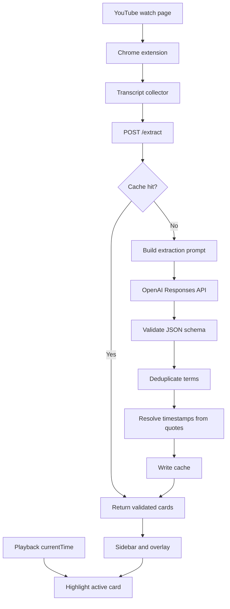

# Footnote

Footnote is a workflow-native AI comprehension layer for technical long-form video. It extracts high-signal concepts from YouTube transcripts, resolves them to playback timestamps, and renders personalized glossary cards directly inside the watching experience.

The project is intentionally framed as an applied AI system rather than a generic chatbot: transcript ingestion, structured LLM extraction, schema validation, deterministic post-processing, cache-first storage, playback-synced UX, known-term personalization, and evaluation tooling all work together to make fragmented knowledge operational.

## Why This Exists

Technical podcasts, lectures, and demo videos contain dense institutional knowledge, but the knowledge is trapped in a linear media format. Footnote explores how an AI system can turn that unstructured stream into just-in-time context without forcing the user to pause, search, or switch into a chat workflow.

This makes the repo a small but concrete example of the broader direction behind many practical AI products: retrieval quality, context engineering, workflow integration, and useful automation around messy source material.

## Current Capabilities

- Chrome extension for YouTube watch pages.
- Transcript collection from the active video.
- Local FastAPI backend for extraction and cache lookup.
- Structured OpenAI extraction prompt with strict JSON validation.
- Deduplication and quote-based timestamp resolution.
- Cache-first responses stored under `data/cache/{video_id}.json`.
- Extraction-run metadata for prompt version, model, latency, transcript size, term count, timestamp coverage, and low-confidence rate.
- Known-term dismissal so familiar concepts stay hidden.
- Sidebar and video overlay UI with playback-synced active-card highlighting.
- Manual and fixture-based evaluation for precision, recall, F1, timestamp coverage, and low-confidence rate.

## Architecture



More detail: [docs/ARCHITECTURE.md](docs/ARCHITECTURE.md)

## Local Backend Setup

```powershell
cd "C:\Users\aruba\OneDrive\Documents\111 Projects\Podcast Footnote Project"
python -m venv .venv
.\.venv\Scripts\Activate.ps1
pip install -r backend\requirements.txt
copy backend\.env.example backend\.env
uvicorn backend.app:app --reload --port 8000
```

Before uncached extraction works, set both values in `backend\.env`:

```powershell
OPENAI_API_KEY=your_api_key
OPENAI_MODEL=your_model_id
```

Health check:

```powershell
Invoke-RestMethod http://localhost:8000/health
```

Expected response:

```json
{
  "ok": true
}
```

## Chrome Extension Setup

1. Open Chrome and go to `chrome://extensions`.
2. Enable Developer mode.
3. Select Load unpacked.
4. Choose the `extension` folder in this repository.
5. Open a YouTube watch page.

The extension injects a Footnote sidebar on YouTube watch pages. It collects captions, sends the transcript to the local backend, renders glossary cards, highlights the active card during playback, and lets you dismiss terms you already know.

## Run Tests

```powershell
pytest
```

## Run An Evaluation Fixture

Footnote includes a small extraction-quality harness. It compares a cached or fixture response against a human-labeled expected term set.

```powershell
python -m backend.evaluation backend\tests\fixtures\evaluation_case.json backend\tests\fixtures\sample_extract_response.json
```

The report includes precision, recall, F1, timestamp coverage, low-confidence rate, matched terms, and false positives.

Evaluation details: [docs/EVALUATION.md](docs/EVALUATION.md)

Example response and report: [docs/EXAMPLE_OUTPUT.md](docs/EXAMPLE_OUTPUT.md)

## Render the Offline Extraction Prompt

Phase 2 includes a prompt-only harness for validating prompt shape against a saved transcript fixture. This does not call the OpenAI API.

```powershell
python -m backend.offline_prompt backend\tests\fixtures\sample_transcript.json --known-term LoRA
```

## Extract Terms

`POST /extract` is cache-first. If `data\cache\{video_id}.json` exists, the backend returns that file without calling OpenAI. On a cache miss, it uses the Responses API, validates the model JSON, writes the cache, and returns the saved response.

Returned terms are post-processed before caching. Footnote deduplicates obvious repeats, matches each model-provided `quote` against the transcript, assigns the earliest matching segment timestamp, and keeps unmatched terms with a low confidence score and no timestamp.

```powershell
$body = @{
  video_id = "abc123"
  video_url = "https://www.youtube.com/watch?v=abc123"
  transcript = @(
    @{ start = 0; duration = 4.2; text = "The model uses LoRA adapters during fine tuning." }
  )
} | ConvertTo-Json -Depth 5

Invoke-RestMethod http://localhost:8000/extract -Method Post -ContentType "application/json" -Body $body
```

## MVP Testing Loop

Use [docs\TESTING_CHECKLIST.md](docs/TESTING_CHECKLIST.md) to evaluate real videos for precision, recall, definition quality, sync quality, cache behavior, and known-term dismissal.

## Portfolio Framing

Footnote is meant to signal product-minded applied AI engineering: taking messy transcript data, extracting structured knowledge, validating model behavior, and embedding the result in a real user workflow.

See [docs/PORTFOLIO_POSITIONING.md](docs/PORTFOLIO_POSITIONING.md) for resume-ready framing, stronger project descriptions, and upgrade themes.

For the final visual polish pass, use [docs/DEMO_CHECKLIST.md](docs/DEMO_CHECKLIST.md) to capture the screenshots/GIFs that should be added once the extension is running against a real video.

## Roadmap

- Move local JSON storage to SQLite for queryable videos, transcripts, terms, known terms, and eval runs.
- Add async extraction jobs for longer transcripts.
- Expand the labeled evaluation set across AI research, finance, science, and business videos.
- Add domain profiles that tune density, categories, and listener assumptions.
- Add a source-backed concept memory so recurring terms receive consistent explanations across videos.
