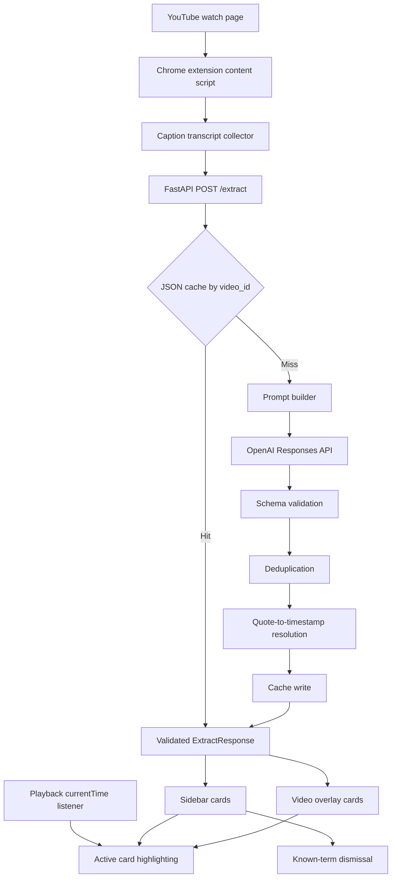

# Architecture

Footnote turns fragmented long-form video knowledge into timestamped, usable context. The first workflow is deliberately narrow: technical YouTube content, local extraction, and a Chrome extension that gives the listener just-in-time glossary cards while the source material is playing.

## Product Bet

The system is not a chatbot wrapper. The user should not need to pause, open another tab, paste a transcript, or ask a question. Footnote watches the workflow, extracts the concepts likely to block comprehension, and brings the explanation back to the moment where it is needed.

## System Map

## Core Contracts

`ExtractRequest` carries the video ID, URL, optional title, listener profile, known terms, and timestamped transcript segments.

`RawExtractedTerm` is the strict model-facing schema. It intentionally excludes timestamps so the backend can resolve timing from source quotes instead of trusting generated numbers.

`TermCard` is the UI-facing unit: term, optional expansion, one-line explanation, deeper contextual explanation, transcript quote, category, resolved timestamp, and confidence.

`ExtractResponse` is cacheable and deterministic after post-processing.

## Design Choices

Cache-first extraction keeps repeated video loads fast and makes evaluation reproducible.

Structured JSON validation catches malformed or drifting model output before it reaches the extension.

Quote-based timestamping keeps the model focused on semantic selection while the backend handles source alignment.

Known-term filtering makes the system adaptive without needing accounts, auth, or a personalization database.

Manual and fixture-based evaluation make prompt work measurable. Precision, recall, timestamp coverage, and low-confidence rate become iteration signals instead of vibes.

Extraction metadata gives every run an operational footprint: prompt version, model, transcript size, latency, term count, timestamp coverage, and low-confidence rate are stored with the response. That makes cache files useful for debugging and future eval dashboards.

## Next Architecture Upgrades

Move cached JSON into SQLite once the project needs eval history, queryable runs, and cross-video concept memory.

Add async job handling for long transcripts so the extension can poll extraction status instead of waiting on one request.

Store extraction runs with model, prompt version, token usage, latency, and post-processing stats.

Add domain profiles, such as AI research, finance, science, or enterprise software, to tune density and category weighting.

Add a small retrieval layer for repeated concepts across videos so definitions can become consistent, source-backed, and versioned over time.
